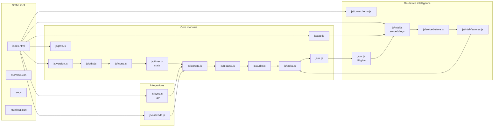

# Architecture



## Load order

Scripts in [`index.html`](index.html) run in declaration order. There are no ES modules; files communicate through shared `function` declarations and a few `window.*` exports.

## State

Core mutable state (tasks, timer, goals, lists, …) lives primarily in [`js/timer.js`](js/timer.js). [`js/storage.js`](js/storage.js) snapshots that state to `localStorage` with an IndexedDB mirror and handles migrations.

**Task classifications:** each task may have a `category` string id (life area). Defaults and user overrides live in `cfg.categories` (see [`js/intel-features.js`](js/intel-features.js): `ensureClassificationConfig`, `DEFAULT_CATEGORY_DEFS`). There is no separate `context` field on tasks — location-style grouping uses lists and tags.

## Release identity

[`js/version.js`](js/version.js) sets `window.ODTAULAI_RELEASE` (the window-global identifier is intentionally left in upper-case after the brand rename — every consumer reads it by this name). The service worker cache name in [`sw.js`](sw.js) must stay aligned (see [`tests/version-sync.test.mjs`](tests/version-sync.test.mjs)).

## On‑device intelligence

A single Transformers.js embedding pipeline drives every "AI" surface — there is no generative LLM in this app.

| Pipeline | File | Model | Purpose | When it loads |
|---|---|---|---|---|
| Embedding | [`js/intel.js`](js/intel.js) | `Xenova/bge-small-en-v1.5` (384‑dim, ~33 MB quantized) on both WebGPU and WASM | Semantic search, smart‑add, harmonize, auto‑organize, duplicates, category centroids, list routing, due‑date kNN, values alignment | Automatically on first idle (`requestIdleCallback`) after page load |

Uses **WebGPU when available, WASM fallback everywhere else** — same model, different backend. Weights are cached by the browser's HTTP cache (the service worker explicitly does **not** precache the CDN model URL, to avoid exhausting the PWA cache quota on mobile).

### Proposed‑op pipeline

Embedding-driven proposers (harmonize, auto-organize, dedupe, reclassify, due‑date suggestion, smart-add enrichment) emit JSON ops in the vocabulary defined in [`js/tool-schema.js`](js/tool-schema.js). Every op flows through the same preview/apply pipeline:

```
proposer (harmonize / auto-organize / dedupe / suggest-due-date / …)
   │
   ▼
validateOps(ops, ctx) in js/tool-schema.js
   │  required fields, enum coercion, id existence checks
   ▼
acceptProposedOps()  →  _pendingOps  →  _renderPendingOps()
   │
   ▼  per-field checkboxes, destructive ACK, source badge
intelApplyPending()  →  executeIntelOp()
   │
   ▼
undo stack (10 deep, 60s extended ring)
```

Safety invariants:

- **No auto‑apply, ever** — ops land in the preview UI with per‑field checkboxes and the 10‑deep undo stack.
- **Destructive ACK** — any `DELETE_TASK`, or ≥5 `ARCHIVE_TASK` / `CHANGE_LIST` in one batch, triggers an additional confirmation before apply.
- **No outbound calls** beyond the one‑time embedding model weight fetch from the Hugging Face CDN.
