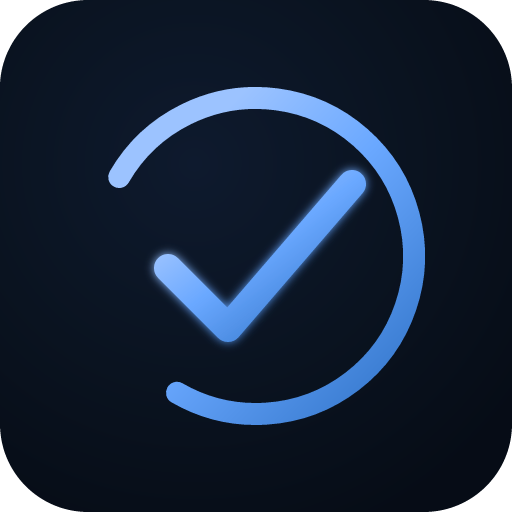

# ODTAULAI

**O**n **d**evice **t**ask **a**pp **u**sing **l**ocal **a**mbient **i**ntelligence.

A privacy-first Pomodoro timer + ClickUp-style task manager that runs entirely in your browser. A compact **embedding model** runs on your device so features can treat tasks by **meaning and context** (semantic similarity)—not just matching words. No account, no tracking, no sync by default. Everything stays on your device.



## Features

**Pomodoro Timer**
- Focus / Short Break / Long Break phases with auto-cycling
- Quick Timers (multi-instance) with presets (1m through 1h)
- Stopwatch with lap tracking
- Repeating chimes (e.g., posture check every 15min)
- Background audio keepalive — chimes fire even when tab is minimized

**ClickUp-Style Tasks**
- Nested tasks with subtasks
- Statuses: Open / In Progress / Review / Blocked / Done
- Priorities: Urgent / High / Normal / Low (with color-coded left stripe)
- Due dates, reminders, recurring tasks (daily/weekdays/weekly/monthly)
- Tags, starred pins, time tracking per task
- Natural-language quick add: `Buy milk tomorrow @urgent #shopping !star ~daily`

**Smart Views**
- Today, Week, Overdue, Unscheduled, Starred, Completed, Archive
- Group by priority, status, due date, or list
- List / Board (kanban) / Calendar views
- Search, filter, sort

**Productivity**
- Cmd+K command palette
- Drag-drop reorder
- Mobile swipe: right to complete, left to delete (both with haptic feedback)
- Dark / light theme
- CSV / Markdown / TXT export
- Full offline support (PWA)

## Installation

### Quick start (local)

1. **Open directly:** Double-click `index.html` — works in any modern browser from `file://`. Data persists in localStorage.

2. **Serve locally** (recommended, enables PWA install):
   ```bash
   # Python 3
   python3 -m http.server 8080

   # Node
   npx serve .

   # Then visit http://localhost:8080
   ```

3. **Install as app:**
   - **Chrome/Edge desktop:** Click the install icon in the address bar
   - **iOS Safari:** Share button → Add to Home Screen
   - **Android Chrome:** Menu (⋮) → Install app
   - **Firefox:** Address bar → install icon (desktop only)

### Deploy to the web

See [DEPLOY.md](DEPLOY.md) for step-by-step guides for:
- GitHub Pages
- Netlify (drag-and-drop)
- Vercel
- Cloudflare Pages
- Your own server

## File structure

```
ODTAULAI/
├── index.html
├── manifest.json
├── sw.js
├── favicon.ico
├── css/main.css
├── js/                         App modules (utils → … → app.js)
├── icons/                      PWA icons (192, 512, maskable, apple-touch, etc.)
├── README.md
└── DEPLOY.md
```

## Browser support

| Browser | Local use | PWA install | Background audio | Offline |
|---------|-----------|-------------|------------------|---------|
| Chrome desktop | ✓ | ✓ | ✓ (while open) | ✓ |
| Chrome Android | ✓ | ✓ | ✓ (while open) | ✓ |
| Safari macOS | ✓ | ✓ | ✓ | ✓ |
| Safari iOS | ✓ | ✓ (Add to Home) | ⚠ limited | ✓ |
| Firefox | ✓ | desktop only | ✓ | ✓ |
| Edge | ✓ | ✓ | ✓ | ✓ |

## Privacy

**ODTAULAI does not:**
- Collect any data
- Send anything to any server
- Use analytics, tracking, or cookies
- Require an account or login
- Sync across devices (intentionally — your data never leaves your device)

**All data is stored in:** `localStorage` (app state) and IndexedDB (embedding cache for the on-device intelligence model). Clearing site data wipes everything. Optional P2P sync is separate and off by default.

## Ambient intelligence (meaning and context, not chat)

ODTAULAI is **not** a conversational LLM: it does not write essays, hold chat, or call cloud APIs with your task text. It **does** use a small **sentence embedding** model so the app can reason about **what your tasks mean**—similar ideas match even when the wording differs.

**Transformers.js** loads **Xenova/gte-small** (~33 MB, 384 dimensions), which turns each task (title + description) into a vector. Cosine similarity in that space approximates **semantic** closeness: context and meaning for search, neighbors, duplicates, and list routing. Runs via **WebGPU** when available, otherwise **WASM** (including **iPhone**).

**What it does**
- **Semantic search** — optional “Semantic” toggle next to the task search box; ranks tasks by cosine similarity to your query.
- **Smart-add suggestions** — kNN over your existing tasks predicts category, priority, tags, effort, etc.
- **Harmonize all fields** — Settings → Intelligence: one action proposes **updates** from embeddings + similar tasks: **values** (Schwartz), **category**, **priority**, **effort**, **context**, **energy**, **tags** (merged, not wiped). Preview each change, apply selected, undo. Use **Align values only** for Schwartz-only; use **Auto-organize into lists** to **move** tasks between lists by list name/description similarity.
- **Duplicate detection** — flags rows similar to another task (≥0.9 cosine); Settings → Find duplicates / merge.
- **Values alignment** — same Schwartz cosine pipeline as harmonize; narrow “values only” button if you do not want category/priority touched.
- **What next?** — rule-based ranking (priority, due date, blockers, optional time/energy fit); **no embeddings**.
- **Similar tasks** — top semantic neighbors in the task detail drawer.
- **Auto-organize into lists** — optional routing of tasks to the list whose name + description best matches by embedding (preview / apply / undo).

**Destructive actions** (archive / delete) stay in your hands: intelligence proposes **updates** and **moves**; merging duplicates still uses archive+merge flows you confirm.

**What it does *not* do**
- No free-form chat, no story-writing, no generative “assistant” loop. Features are **deterministic**: embed text → compare vectors → apply rules. The “understanding” is **geometric** (embeddings), not a model that invents new prose about your tasks.

Model files are fetched from **Hugging Face / jsDelivr** on first use, then cached by the browser; the service worker does not cache those URLs so the runtime cache works as intended.

## Background audio — how it works

The timer keeps playing chimes when the tab is minimized/backgrounded by:
1. Pre-scheduling audio events on the Web Audio clock (unaffected by setInterval throttling)
2. Playing a silent 20Hz oscillator at 0.0001 gain to keep the tab "active" in the browser's eyes
3. Registering with the Media Session API (appears in OS media controls)
4. Requesting a Wake Lock on mobile

**Limitation:** When the browser is *fully closed*, nothing runs. Install as a PWA for the OS to treat it more like a standalone app.

## License

MIT. Do what you want.

## Credits

Built with vanilla JavaScript, HTML, CSS — no frameworks, no build step. Runtime loads **@huggingface/transformers** and **chrono-node** from CDN when needed.
